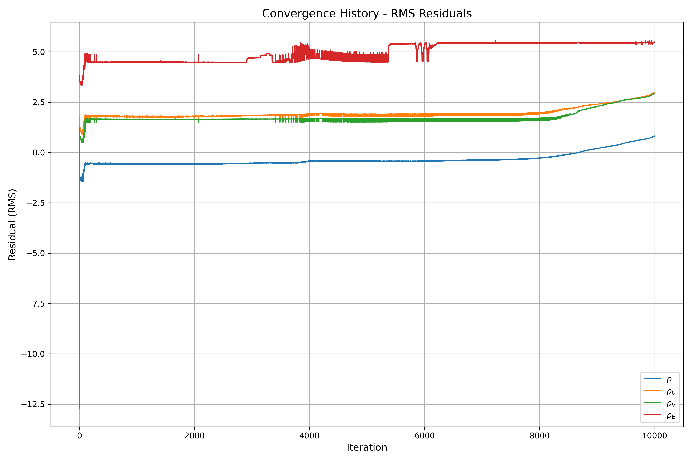
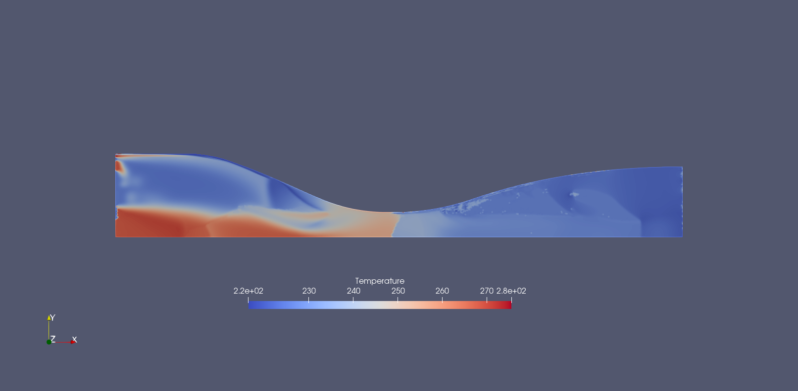

# GSoC SU2 Proposal Preparations: Getting Familiar With Data Driven Simulations using MLPCpp

## Prerequisites

### Setting Up Environment

1. Download the [SU2_Dataminer](https://github.com/EvertBunschoten/SU2_DataMiner)
2. To avoid Python module issues, set up a conda environment using the following `environment.yml` file:

```yaml
name: su2-env
channels:
  - defaults
  - conda-forge
dependencies:
  - python=3.11
  - numpy
  - pip
  - tqdm
  - matplotlib
  - scikit-learn
  - tensorflow
  - pyfiglet
  - mpi4py
  - swig
  - pip:
    - CoolProp
    - cantera
```

3. Install the environment with:

```bash
conda env update -f environment.yml
```

4. Make sure you add the following lines to `~/.bashrc` to ensure that the `PYTHONPATH` is updated.
```bash
export PINNTRAINING_HOME=/home/baadalvm/SU2_DataMiner
export PYTHONPATH=$PYTHONPATH:$PINNTRAINING_HOME
export PATH=$PATH:$PINNTRAINING_HOME/bin

``` 


### Installing SU2

1. Download SU2
2. Checkout the develop branch
3. Configure with meson:

```bash
./meson.py build -Denable-pywrapper=true -Denable-mlpcpp=true --prefix=/home/baadalvm/su2_develop/SU2
```

4. Compile and install:

```bash
./ninja -C build install
```

> Note: The MLCPP contains the code which handles the ML part of the simulation.

## Running the Simulation

1. Activate the conda environment:

```bash
conda activate su2_env
```

2. Run the following scripts in sequence:
   - `0:generate_config.py`
   - `1:generate_fluid_data.py`
   - `2:train_PINN.py`

3. Handling the SU2 execution:
   - The `3:run_SU2.py` script may have issues with the Python wrapper inside the conda environment
   - Modified approach using `run_some.py` (with the following differences):

```diff
baadalvm@baadalvm:~/gsoc_proposal/PhysicsInformed$ diff 3\:run_SU2.py run_some.py 
29c29
< import pysu2
---
> #import pysu2
265,268c265,268
< # Initialize NICFD simulation.
< driver = pysu2.CSinglezoneDriver("config_NICFD_PINN.cfg",1, comm)
< driver.StartSolver()
< driver.Finalize()
\ No newline at end of file
---
> ## Initialize NICFD simulation.
> #driver = pysu2.CSinglezoneDriver("config_NICFD_PINN.cfg",1, comm)
> #driver.StartSolver()
> #driver.Finalize()
```

4. Execute the workflow:
   - Run `run_some.py` to generate the mesh and configuration file
   - Use SU2 installed outside the conda environment to run the simulation:

```bash
mpirun -np 2 SU2_CFD config_NICFD_PINN.cfg
```

## Simulation Results

<p align="center">
  
  <br>
  <em>Residuals plot</em>
</p>

<p align="center">
  
  <br>
  <em>Temperature contours</em>
</p>
